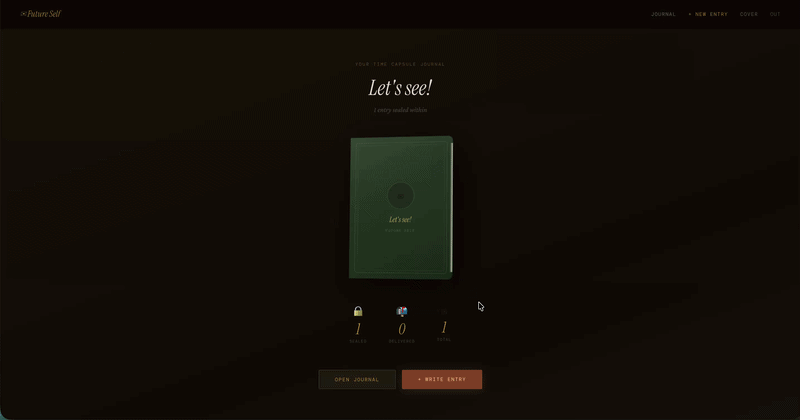
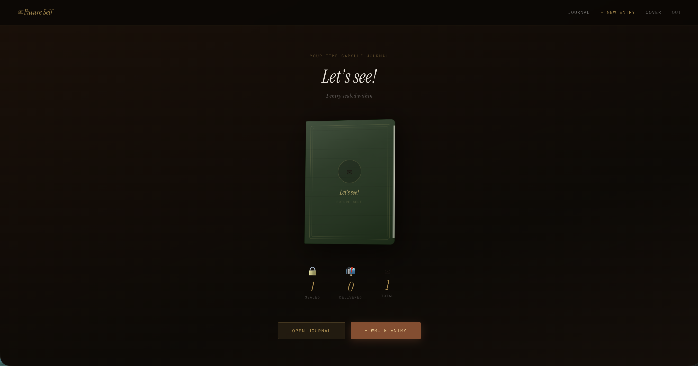
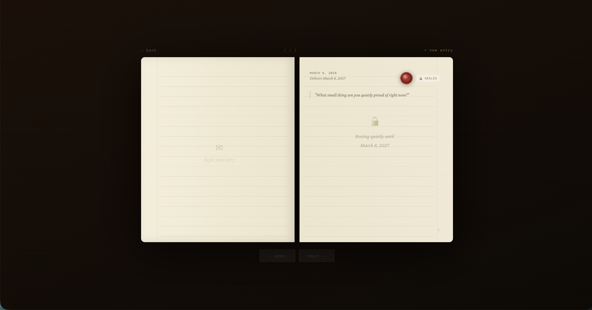
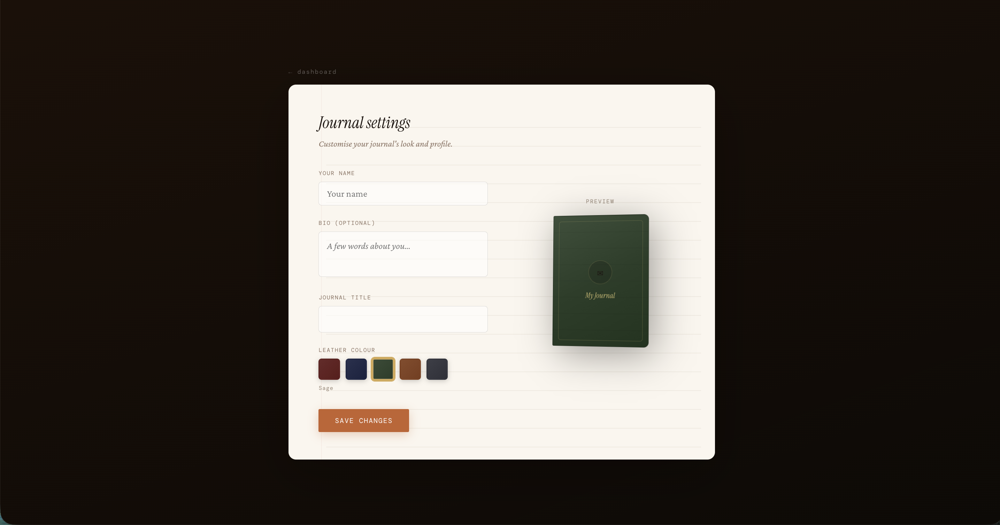

# Future Self

A digital time-capsule journal that feels like writing letters by candlelight — to be opened by your future self exactly when you choose.

Seal memories, thoughts, voice notes or short videos with a custom wax stamp. Watch them rest quietly in your leather-bound journal until the delivery date arrives.

---

## Demo

<p align="center">
  
</p>

<p align="center">
  <em>
  Choose a prompt → write a letter → set delivery in 3 years → craft a wax seal → seal the capsule for the future
  </em>
</p>

---

# The Ritual

Sit at a quiet desk.
Feel the texture of cream paper under your fingers.
Hear the soft scratch of a fountain pen.
Watch wax drip and harden around your chosen symbol.
Close the book — and let time carry your words forward.

This is a slow, private conversation across years.
No feeds. No likes. Just you, today, speaking gently to you, tomorrow.

---

# Core Features

### Three capsule formats

• **Written letters** on real lined paper
• **Voice recordings** with pulsing waveform & live transcript highlighting
• **Short video messages**

---

### Immersive 3D journal

Floating leather book with subtle hover tilt and gold detailing
Realistic page-flip animation
Left page shows faded previous entry; right page holds the current one

---

### Wax seal studio

Pour animated wax in your chosen color
Upload any image (e.g. pet photo) → it becomes an engraved stamp
Candle flicker → seal presses down with organic drip texture

---

### Personalized cover

Choose from **5 leather tones** (deep sage, midnight blue, terracotta, etc.)
Custom journal title & optional bio
Live preview of your book floating beside the form

---

### Gentle timed delivery

Capsules seal instantly and become immutable
Hourly check delivers them (beautiful arrival email via Resend + in-app reveal)
Confetti celebration on sealing

---

### Auth & ownership

Email + Google sign-in
Supabase row-level security — your capsules stay private

---

# Screenshots

### Landing Page

<p align="center">
  
</p>

---

### Journal Writing Experience

<p align="center">
  
</p>

---

### Wax Seal Studio

<p align="center">
  
</p>

---

# Tech Stack

**Frontend**
Next.js App Router
React Server Components

**Styling**
Tailwind CSS with custom palette
(Cream paper, terracotta/rust, gold foil, dark walnut)

**Fonts**

Instrument Serif (display)
Crimson Pro (body)
DM Mono (UI)

**Animations & 3D**

Framer Motion (page flips, tilts)
CSS perspective

**Canvas Wax Seal**

HTML Canvas with layered gradients
Custom drip brushes

**Backend / Storage**

Supabase

* Auth
* Postgres
* Storage buckets

  * `capsule-media`
  * `seal-art`
  * `cover-images`

**Emails**

Resend (fallback to in-app if no API key)

**Scheduling**

Vercel Cron (hourly capsule delivery)

---

# Quick Start (Local)

Clone the repository

```bash
git clone https://github.com/YOUR_USERNAME/future-self.git
cd future-self
```

Install dependencies

```bash
npm install
```

Create environment file

```bash
cp .env.example .env.local
```

Fill the environment variables

* Supabase keys
* Resend API key (optional)
* CRON_SECRET

Start development server

```bash
npm run dev
```

App will run at:

```
http://localhost:3000
```

Detailed deployment guide → `DEPLOY.md`

---

# Deployment (Vercel — ~10 min)

1. Push the repo to GitHub
2. Go to

```
https://vercel.com/new
```

3. Import the repository
4. Add environment variables from `.env.example`
5. Deploy

After deployment:

Update **Supabase Auth Redirect URLs** with your Vercel domain.

---

## Test Cron Delivery

```bash
curl -H "Authorization: Bearer YOUR_CRON_SECRET" \
https://your-app.vercel.app/api/cron/deliver
```

---

# Contributing

Pull requests are welcome — especially around:

• Smoother mobile interactions
• Accessibility improvements (ARIA + keyboard navigation)
• Performance optimization for canvas and animation effects

---